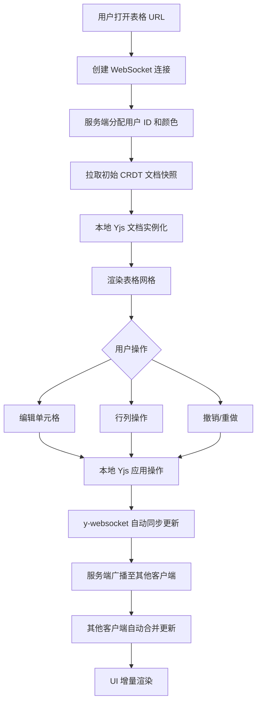
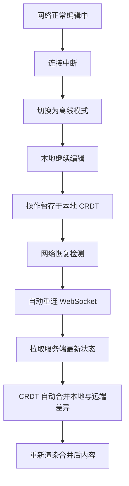

# 协同电子表格产品需求文档 (PRD)

## 1. 产品概述

一款基于 CRDT（无冲突复制数据类型）的实时协同电子表格应用，支持多用户同时编辑，自动解决并发冲突，提供离线编辑和重连合并能力。目标用户为需要多人协作进行数据录入、分析和管理的团队。产品核心价值在于提供接近本地编辑体验的无延迟协同操作，以及去中心化的冲突解决机制确保数据一致性。

## 2. 核心功能

### 2.1 用户角色

| 角色 | 说明 | 核心权限 |
|------|------|----------|
| 协作者 | 所有访问表格的用户，无需注册即可加入会话 | 编辑单元格、管理行列、查看其他用户状态、撤销重做操作 |

### 2.2 功能模块

1. **协同表格编辑页面**：高性能网格渲染、单元格编辑、实时光标同步、CRDT 数据同步、协同操作面板
2. **协同会话管理模块**：用户加入/离开通知、在线用户列表、协作者颜色标识
3. **行列操作模块**：行/列插入、删除、隐藏、取消隐藏
4. **撤销重做模块**：基于 CRDT 操作粒度的撤销/重做历史
5. **数据类型支持模块**：文本、数字、日期、布尔值的识别与格式化展示

### 2.3 页面详情

| 页面名称 | 模块名称 | 功能描述 |
|----------|----------|----------|
| 协同表格编辑页 | 顶部工具栏 | 显示文档名称、在线用户头像列表、撤销/重做按钮、行列操作按钮 |
| 协同表格编辑页 | 列标题行 | 显示 A、B、C... 列标识，支持右键菜单（插入/删除/隐藏列） |
| 协同表格编辑页 | 行标题列 | 显示 1、2、3... 行标识，支持右键菜单（插入/删除/隐藏行） |
| 协同表格编辑页 | 单元格网格 | Canvas 或虚拟滚动渲染，支持点击选中、双击编辑、显示其他用户光标和选区 |
| 协同表格编辑页 | 单元格编辑器 | 弹出式编辑框，支持文本/数字/日期/布尔值输入，自动类型检测 |
| 协同表格编辑页 | 协同状态面板 | 底部状态栏，显示当前连接状态、在线人数、最后同步时间 |
| 协同表格编辑页 | 用户加入提示 | 顶部 Toast 通知，显示用户加入/离开信息 |

## 3. 核心流程

### 3.1 用户协作主流程

用户打开表格链接 → 系统自动创建/加入协同会话 → 从服务端拉取初始 CRDT 文档 → WebSocket 建立连接 → 本地渲染表格内容 → 用户执行编辑操作 → 操作立即应用本地并通过 CRDT 编码广播 → 接收其他用户操作并自动合并 → 实时更新 UI 展示。

### 3.2 离线重连流程

用户网络中断 → 本地继续编辑（Yjs 离线支持）→ 网络恢复 → 自动重连 → 服务端推送期间累积的更新 → 本地自动合并冲突 → UI 同步最终状态。

## 4. 用户界面设计

### 4.1 设计风格

- **主色调**：深海蓝 `#1e3a5f` 作为品牌色，搭配青绿色 `#10b981` 作为协同成功状态色
- **辅助色**：每个协作者分配唯一高亮色（橙 `#f97316`、紫 `#a855f7`、粉 `#ec4899`、青 `#06b6d4` 等）用于光标和选区标识
- **背景色**：浅灰 `#f8fafc` 画布背景，纯白 `#ffffff` 单元格背景，极浅灰 `#f1f5f9` 交替行
- **按钮风格**：圆角 6px，主按钮深色填充+白色文字，次要按钮浅灰背景+深色文字，悬停状态有细微亮度变化
- **字体**：标题使用 "Space Grotesk" 现代几何无衬线字体，正文和数字使用 "JetBrains Mono" 等宽字体以保证表格数据对齐
- **布局风格**：工具密集型专业应用布局，顶部固定工具栏，左侧行标题 + 顶部列标题 + 中央网格的经典电子表格布局
- **视觉细节**：选中单元格 2px 蓝色描边，光标带有用户名标签浮动显示，选区半透明颜色覆盖

### 4.2 页面设计概览

| 页面名称 | 模块名称 | UI 元素 |
|----------|----------|---------|
| 协同表格编辑页 | 顶部工具栏 | 深色背景（#1e3a5f），白色文字，左侧文档标题，右侧用户头像圆+在线指示器+撤销重做按钮 |
| 协同表格编辑页 | 列标题行 | 浅灰背景（#e2e8f0），加粗等宽字体，悬停高亮，选中列整列浅蓝背景 |
| 协同表格编辑页 | 行标题列 | 与列标题样式一致，显示行号 |
| 协同表格编辑页 | 单元格网格 | 白色背景，极细灰色边框（#e5e7eb），交替行淡灰，等宽数字字体左对齐、文本左对齐 |
| 协同表格编辑页 | 远程光标 | 带颜色竖线 + 上方浮动用户名标签（同色背景圆角），轻微脉冲动画提示存在感 |
| 协同表格编辑页 | 远程选区 | 对应颜色半透明填充 + 1px 颜色描边，避免遮挡底层文字 |
| 协同表格编辑页 | 单元格编辑器 | 白色弹出框 + 2px 蓝色描边，自动适配单元格位置，输入框无边框样式 |
| 协同表格编辑页 | 底部状态栏 | 深色背景（#0f172a），小号白色文字，左侧连接状态指示圆点，右侧在线人数 |
| 协同表格编辑页 | Toast 通知 | 右上角滑入动画，深色半透明背景，白色文字，3秒自动消失 |

### 4.3 响应式设计

- **桌面端（默认）**：完整工具栏、行列标题、最大可视网格区域
- **平板端**：工具栏紧凑布局，减少间距，网格自适应宽度
- **移动端**：工具栏简化为图标按钮，支持横向滑动浏览表格，双击单元格全屏编辑

### 4.4 动效设计

- 用户光标出现：从透明渐入 + 轻微 Y 轴位移
- 单元格值变更：背景色短暂闪烁对应协作者颜色后淡出
- 行列插入/删除：相邻行列平滑过渡位移动画
- Toast 通知：从右上角滑入 + 3 秒后滑出
- 远程选区更新：位置变化使用 CSS transform 平滑过渡
