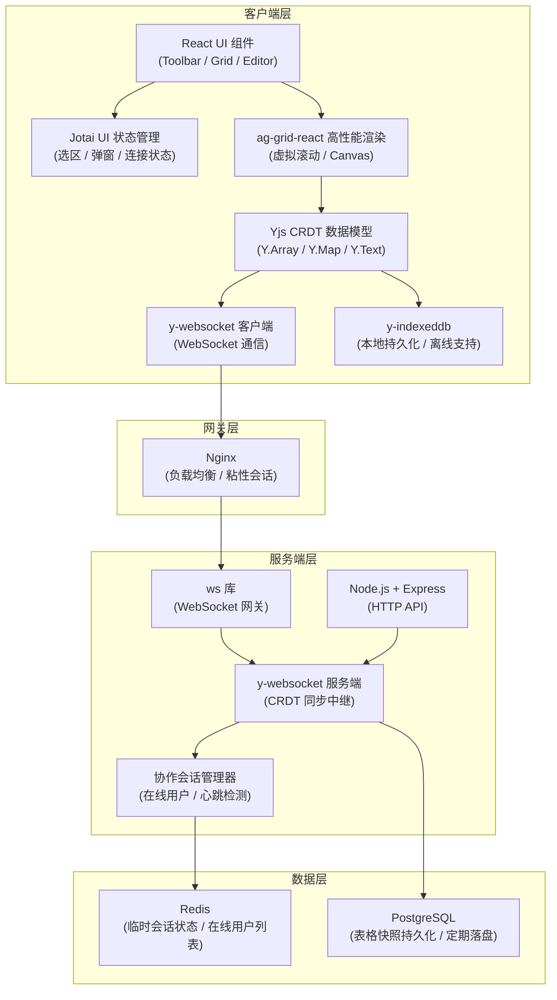
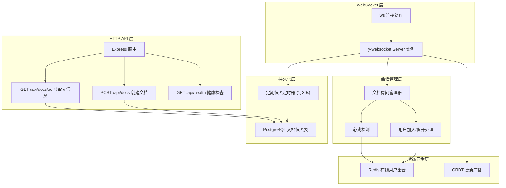
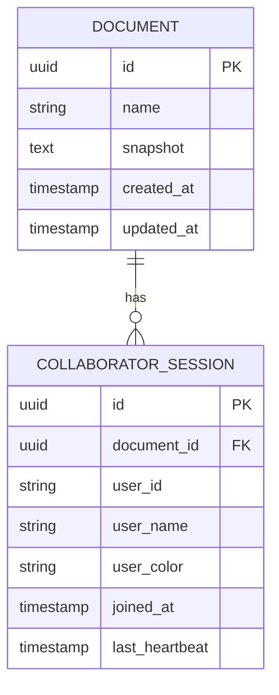

# 协同电子表格技术架构文档

## 1. 架构设计



## 2. 技术说明

### 2.1 前端技术栈

| 技术 | 版本 | 用途 |
|------|------|------|
| React | 18.x | UI 框架 |
| TypeScript | 5.x | 类型安全 |
| Vite | 5.x | 构建工具 |
| Tailwind CSS | 3.x | CSS 工具类 |
| ag-grid-react | 31.x | 高性能表格网格渲染（虚拟滚动、Canvas） |
| yjs | 13.x | CRDT 核心数据模型库 |
| y-websocket | 2.x | Yjs WebSocket 通信适配器 |
| y-indexeddb | 11.x | 本地 IndexedDB 持久化（离线支持） |
| jotai | 2.x | 轻量级原子化 UI 状态管理 |
| uuid | 9.x | 用户唯一 ID 生成 |

### 2.2 后端技术栈

| 技术 | 版本 | 用途 |
|------|------|------|
| Node.js | 20.x | 服务端运行时 |
| Express | 4.x | HTTP 服务框架 |
| ws | 8.x | WebSocket 库 |
| y-websocket | 2.x | 服务端 CRDT 同步 |
| ioredis | 5.x | Redis 客户端（会话状态） |
| pg | 8.x | PostgreSQL 客户端（数据持久化） |
| cors | 2.x | 跨域处理 |

### 2.3 基础设施

| 组件 | 用途 |
|------|------|
| Nginx | 反向代理、负载均衡、WebSocket 粘性会话 |
| Redis | 存储在线用户列表、临时会话状态、心跳信息 |
| PostgreSQL | 存储表格文档的周期性快照，用于数据备份和初始化 |

## 3. 前端路由定义

| 路由 | 用途 |
|------|------|
| `/` | 首页，引导创建新表格或输入文档 ID |
| `/doc/:docId` | 协同表格编辑主页面 |

## 4. 核心数据结构定义

### 4.1 Yjs CRDT 文档结构

```typescript
// Yjs 文档根节点
interface YDocRoot {
  // 单元格数据：Y.Map<cellKey, CellData>
  // cellKey 格式: `${rowIndex}:${colIndex}`
  cells: Y.YMap<CellData>;
  
  // 行元数据：Y.Array<RowMeta>
  rows: Y.YArray<RowMeta>;
  
  // 列元数据：Y.Array<ColMeta>
  columns: Y.YArray<ColMeta>;
}

interface CellData {
  value: string | number | boolean | null;
  type: 'text' | 'number' | 'date' | 'boolean' | 'empty';
  format?: {
    bold?: boolean;
    italic?: boolean;
    align?: 'left' | 'center' | 'right';
  };
  updatedBy: string;      // 用户 ID
  updatedAt: number;      // 时间戳
}

interface RowMeta {
  index: number;
  height: number;
  hidden: boolean;
}

interface ColMeta {
  index: number;
  width: number;
  hidden: boolean;
}

// 协作者状态（通过 Yjs Awareness 协议同步）
interface AwarenessState {
  user: {
    id: string;
    name: string;
    color: string;
    avatar?: string;
  };
  cursor: {
    row: number;
    col: number;
    anchor: { row: number; col: number } | null;
    focus: { row: number; col: number } | null;
  } | null;
}
```

### 4.2 本地 UI 状态（Jotai Atoms）

```typescript
// 当前选中区域
interface Selection {
  startRow: number;
  startCol: number;
  endRow: number;
  endCol: number;
}

// 编辑中的单元格
interface EditingCell {
  row: number;
  col: number;
  initialValue: string;
}

// Toast 通知
interface Toast {
  id: string;
  type: 'info' | 'success' | 'warning' | 'error';
  message: string;
}

// 连接状态
type ConnectionStatus = 'connecting' | 'connected' | 'disconnected' | 'offline';
```

## 5. 服务端架构图



## 6. 数据模型

### 6.1 实体关系图



### 6.2 PostgreSQL DDL

```sql
-- 文档表：存储 CRDT 快照
CREATE TABLE documents (
    id UUID PRIMARY KEY DEFAULT gen_random_uuid(),
    name VARCHAR(255) NOT NULL DEFAULT 'Untitled Spreadsheet',
    snapshot BYTEA NOT NULL,
    created_at TIMESTAMPTZ NOT NULL DEFAULT NOW(),
    updated_at TIMESTAMPTZ NOT NULL DEFAULT NOW()
);

CREATE INDEX idx_documents_updated_at ON documents(updated_at);

-- 协同会话表（可选，主要状态存在 Redis，此表用于审计）
CREATE TABLE collaborator_sessions (
    id UUID PRIMARY KEY DEFAULT gen_random_uuid(),
    document_id UUID NOT NULL REFERENCES documents(id) ON DELETE CASCADE,
    user_id VARCHAR(64) NOT NULL,
    user_name VARCHAR(128) NOT NULL,
    user_color VARCHAR(16) NOT NULL,
    joined_at TIMESTAMPTZ NOT NULL DEFAULT NOW(),
    left_at TIMESTAMPTZ,
    last_heartbeat TIMESTAMPTZ NOT NULL DEFAULT NOW()
);

CREATE INDEX idx_sessions_document_id ON collaborator_sessions(document_id);
CREATE INDEX idx_sessions_last_heartbeat ON collaborator_sessions(last_heartbeat);

-- Redis Key 设计
-- doc:{docId}:users        -> Set<userId>       在线用户集合
-- doc:{docId}:user:{userId} -> JSON              用户详细信息（name, color）
-- doc:{docId}:heartbeat    -> Hash<userId, ts>   心跳时间戳
```

## 7. API 定义

### 7.1 HTTP API

```typescript
// POST /api/docs - 创建新文档
interface CreateDocRequest {
  name?: string;
}
interface CreateDocResponse {
  id: string;
  name: string;
  createdAt: string;
}

// GET /api/docs/:id - 获取文档元信息
interface GetDocResponse {
  id: string;
  name: string;
  updatedAt: string;
  collaboratorCount: number;
}

// GET /api/health - 健康检查
interface HealthResponse {
  status: 'ok';
  uptime: number;
  redisConnected: boolean;
  postgresConnected: boolean;
}
```

### 7.2 WebSocket 协议

使用 `y-websocket` 标准协议：
- 连接路径：`/ws/:docId`
- 查询参数：`?userId=xxx&userName=xxx&userColor=xxx`
- 协议基于 Yjs 自有二进制同步编码 + Awareness 协议

## 8. 项目目录结构

```
dzx_273/
├── client/                          # 前端项目
│   ├── src/
│   │   ├── components/
│   │   │   ├── Toolbar.tsx          # 顶部工具栏
│   │   │   ├── SpreadsheetGrid.tsx  # 表格网格主组件
│   │   │   ├── CellEditor.tsx       # 单元格编辑器
│   │   │   ├── RemoteCursors.tsx    # 远程光标叠加层
│   │   │   ├── UserAvatarList.tsx   # 在线用户头像列表
│   │   │   ├── StatusBar.tsx        # 底部状态栏
│   │   │   └── ToastContainer.tsx   # Toast 通知容器
│   │   ├── store/
│   │   │   ├── atoms.ts             # Jotai 状态原子
│   │   │   └── useYjs.ts            # Yjs Hook
│   │   ├── hooks/
│   │   │   ├── useCollaboration.ts  # 协同逻辑 Hook
│   │   │   ├── useAwareness.ts      # Awareness 同步 Hook
│   │   │   └── useUndoRedo.ts       # 撤销重做 Hook
│   │   ├── utils/
│   │   │   ├── cellTypes.ts         # 单元格类型检测与格式化
│   │   │   ├── colors.ts            # 协作者颜色分配
│   │   │   └── colIndex.ts          # 列索引 A/B/C 转换
│   │   ├── types/
│   │   │   └── index.ts             # 全局类型定义
│   │   ├── App.tsx
│   │   ├── main.tsx
│   │   └── index.css
│   ├── package.json
│   ├── tsconfig.json
│   ├── vite.config.ts
│   └── tailwind.config.js
│
├── server/                          # 后端项目
│   ├── src/
│   │   ├── index.ts                 # 入口文件
│   │   ├── websocket/
│   │   │   └── setup.ts             # WebSocket + y-websocket 初始化
│   │   ├── routes/
│   │   │   └── api.ts               # HTTP API 路由
│   │   ├── services/
│   │   │   ├── redis.ts             # Redis 连接与操作
│   │   │   ├── postgres.ts          # PostgreSQL 连接与操作
│   │   │   └── snapshot.ts          # 快照定期落盘服务
│   │   ├── middleware/
│   │   │   └── cors.ts
│   │   └── config.ts
│   ├── package.json
│   ├── tsconfig.json
│   └── .env.example
│
└── package.json                     # Monorepo 根配置
```
